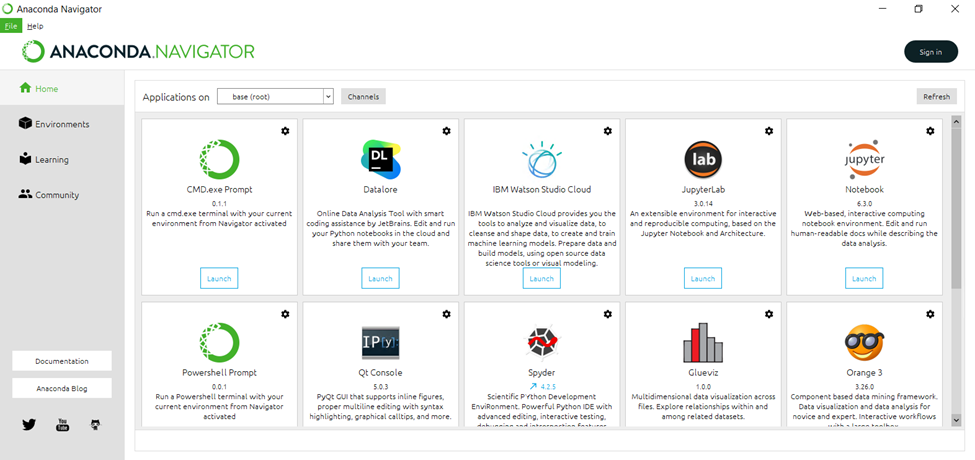

# 1.3. 配置Windows/macOS个人计算机的工作环境

Anaconda是专为数据科学行业的技术人员设计的程序管理器，由数据科学从业者、数据驱动型企业和开源社区维护。它擅长解决计算机环境问题，使得开发者更专注于数据科学应用的构建。在Anaconda中，所有的软件都是开源且每天都在不断变化的，而软件负责控制对模型、数据和包的访问。访问 [https://www.anaconda.com/](https://www.anaconda.com) 网站，在Productions标签页选择Individual Edition下载，按照默认设置安装即可。

如果站点下载缓慢，可以访问清华大学开源软件镜像站的[https://mirrors.tuna.tsinghua.edu.cn/anaconda/archive/](https://mirrors.tuna.tsinghua.edu.cn/anaconda/archive/) 页面，它按时间从晚到早排序，找到最新版本的文件，根据所用操作系统选择版本。

安装完毕后打开Anaconda，左侧有4个标签页，如图 3所示。其中Home标签集成了常用的软件，我们主要使用Spyder和Notebook软件。我们在Spyder中创建Python程序源码文件和运行，程序源码以`.py`结尾。这种程序源码不依赖安装环境，对方即使只安装了python而没有任何其他编辑工具，也可以在命令行输入`python main.py`运行程序。之中main.py替换为所写的程序文件名。Notebook是探索性数据分析的工具，程序的运行以“窗格”而不是整个文件为单位，程序源码以`.ipynb`结尾。将Notebook创建的文件分发给他人后，他人必须也运行Notebook软件才能阅读和执行这个文件。



Jupyter Notebook 也可以直接通过Python环境安装：通过包管理器或pip命令安装jupyter函数库，在命令行或终端中输入`jupyter notebook` 即可启动Jupyter Notebook. 命令行中会提示软件所在的网址，用浏览器打开网址，即可访问Jupyter Notebook.

要访问新版的Jupyter Lab, 在命令行或终端中输入`jupyter lab` 即可启动Jupyter Lab.

要结束Jupyter Notebook或Jupyter Lab, 在命令行或终端中输入一次`Ctrl+C` 并根据提示输入`y` ，确认结束服务， 或连续输入2次`Ctrl+C` 结束服务。

要使得Jupyter Notebook兼容R语言程序，需在Python包管理器中安装R内核，在命令行或终端中输入

```
conda install -c r r-irkernel
```

或

```
pip install r-irkernel
```

在R语言环境中运行

```
install.packages(c('repr', 'IRdisplay', 'evaluate', 'crayon', 'pbdZMQ', 'devtools', 'uuid', 'digest'))
install.packages('IRkernel')
IRkernel::installspec()
```

然后，回到命令行或终端，启动Jupyter Notebook.

我们首先介绍Notebook软件的使用方法。点击“启动”按钮运行Notebook，程序会启动系统默认的浏览器到如图 4所示的页面。

.png>)

这是所在用户的个人文件夹，我们通过点击文件夹导航到需要保存程序的位置，点击表格右上侧的“新建”按钮，选择“Python 3”格式，就进入了新建文件的页面，如图 5所示。单击“jupyter”徽标后的文件名，可以修改文件名（不需要包含文件扩展名）。上方和大部分软件类似地，提供了“文件”“编辑”等多个菜单，可以探索许多功能。

.png>)

而页面的主要部分如前所述，以“In \[1]:”等开头的就是一个窗格，是运行的基本单位。图中以蓝色左侧框线框出的窗格，是“当前选中窗格”，当点击菜单栏的“运行按钮”时，被运行的即是这个窗格。值得注意的是，Notebook中每个窗格的最后一行可以直接输入变量名称，使得变量内容回显在输出位置。这是内存中变量内容的直接体现，而不是print函数的结果，例如字符串会带有双引号。这个做法在Spyder或其他编写“.py”文件的软件中是不允许的：某一行直接写入变量名称，会有读写耗时和占用内存，但不会对变量作出任何操作，开发者也看不到任何响应。Notebook还会对一些回显结果作显示上的优化，例如pandas.DataFrame这个类（将在后续章节介绍）的实例，会被回显为一张格式整齐的表格形式，使得变量内容更易读。

另外，编辑器在调用python解释器运行“.py”文件时，会在运行结束时擦去所有变量内容，而Notebook只会在关闭这个“.ipynb”文件，或退出浏览器数分钟后，或停止运行Notebook时才会擦出变量内容。这意味着如果开发者在某个窗格里，曾经运行过但是后来废弃了一些变量，在下面的窗格仍然引用这个变量，程序仍然能取得变量废弃前的值。这会引发严重的错误，而且开发者不容易察觉。

Notebook的好处是在探索性数据分析时，可以将数据预处理的过程分为许多小步骤，写每个小步骤时新建一个窗格。在编写程序时可以根据回显的结果，反复修改窗格中的内容（注意不要引用废弃的变量名），直到达到预期的结果，而不需要每次都从头开始运行。

Notebook在教学中也有很方便的用途，选择Cell->Cell Type选项卡中的选项，如图 6所示，可以将窗格的类型在Markdown格式和程序源码格式切换。Markdown是一种富文本格式语言，不参与程序运行。教师可以将标题，作业要求写在Markdown窗格里；学生也可以编辑这些窗格，将程序运行结果形成分析，对题目作答。

.png>)

另一种编写程序的环境是Spyder，也在Anaconda套件中提供。打开Spyder软件将出现3个区域：左侧的编辑区、右上方的文档区、右下方的命令行区，如图 7所示。

.png>)

编辑区可以编写代码，点击菜单栏上的“运行”按钮即运行整个文件。将光标置于函数名称上，按`Ctrl+I`组合键，在文档区会显示函数的使用方法。而复制程序片段到命令行区，可以运行这部分程序，和Notebook的窗格实现类似（事实上它们都是用IPython解释器实现）。类似Spyder的编辑器还有许多进阶的功能，例如断点检查、内存检视、远程调试等。

回到Anaconda的主页，左侧第2个标签页是conda环境管理页，其中base (root) 是默认的环境，而右侧列出了该环境中所有已安装的依赖库。点击环境列表底端的Create按钮可以新建环境，在弹出的表单中填写环境名称和Python版本。搜索依赖库spyder和jupyter并安装，即可使用新环境打开软件。在如图 3所示的软件页面，Applications on下拉选项中选择新环境，软件也将在新环境中使用。
